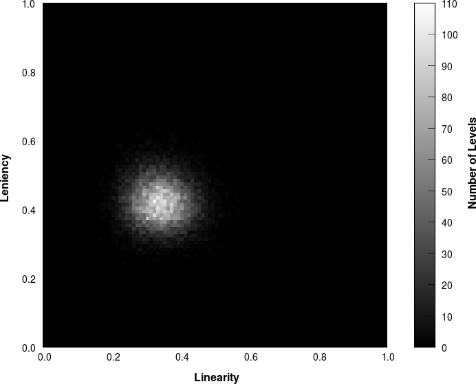

# Introduction {#introduction .unnumbered}

Procedural content generation has been employed in several aspects of
video game design. A wide variety of tools and techniques exist to help
designers generate content like textures [@textmaker], cities
[@cityengine], trees [@speedtree] and other natural features. In certain
applications, content such as game worlds, levels and stories [@pierce]
are generated in real-time to give the player a unique experience
anytime they play. In this report, the focus would be entirely on
procedural level generation.

*Rogue*, a genre defining dungeon crawler, was responsible for the
earliest known level generator. The designers of Rogue wanted to create
a game that would provide a new adventure any time it was played
[@wichman]. Their technique although simple, was rather intuitive and
very revolutionary for the time; it involved splitting the world up into
dungeons, linking up the dungeons and littering the dungeons with
enemies and loot. The level generation concepts found in Rogue have
successfully been applied to newer games such as *Diablo II* and
*Civilization*.

Unlike role player games and dungeon crawlers, platform games provide a
different kind of challenge to level generators. Physics constraints,
placement of game objects and certain domain specific characteristics of
the game for which the levels are being generated, provide several new
dimensions that level generators need to consider when generating
content [@comptonma]. One area concerning procedural level generators
that has experienced a lot of research interest is the evaluation of the
properties of the content generated by a given generator. Due to the
fact that platform level generators posses the ability to generate a
large number of content in a short space of time, visual analysis and
other informal approaches may prove inadequate for the purpose of
evaluating generators. To solve this problem, researchers have devised
metrics such as linearity, leniency, density, pattern density, pattern
variation and a collection of others to help in quantitatively measuring
the properties of levels generated
[@alessandro; @smithandwhitehead; @comparative]. It is also worth noting
that whatever content generators produce would ultimately be used by
humans. Therefore, to judge the quality of levels from the human
perspective, researchers have found ways of either incorporating human
feedback into measurement techniques [@marioai] or artificially modeling
the behaviour of human players when analyzing generated content
[@hoeft]. With the ability to evaluate level generators, specific
generators can be created to meet specific design goals
[@smithandwhitehead; @evaluation].

# Meet Ei {#meet-ei .unnumbered}

Ei is a two-dimensional, tile-based platform game featuring a titular
character (called Ei). Like in most platform games, Ei has the ability
to run on platforms, jump over gaps, pick up collectibles and avoid
enemies. Visually Ei features silhouette style graphics where the
characters and other game objects are completely dark and are presented
over a brightly coloured background.

{width="\\linewidth"}

A level editor is incorporated into the game to make it possible for
levels to be created and played. Given that Ei was primarily built for
the purpose of experimenting with level generators, the level generator
features a code editor which makes it possible to provide logic for
level generation. It also includes a simple evaluation toolkit which is
capable of generating a large number of levels to help determine the
expressive range of a given level generator.

To test the level generator and its code editor, a simple level
generator was implemented. This generator uses an approach similar to
that found in the *Infinite Super Mario Brothers* game. The levels are
generated by randomly placing level sections side by side. The rest of
this report explains how this particular generator works.

# The Random Generator {#the-random-generator .unnumbered}

The Random level generator generates levels by piecing together
pre-designed level sections from left to right. There are a total of
five such sections. These are: flat grounds, gaps, gaps with spikes,
elevated platforms, spring jumps and flat grounds with retractable
spikes. The chance of any of these sections occurring at any point
during generation is biased by a difficulty parameter. This difficulty
parameter can have an integer value ranging from one (1) to ten (10). A
higher difficulty value would increase the odds by which sections that
are expected to be difficult to play are selected.

Another consideration made during the generation of the levels, is the
order in which level sections are placed after each other. Placing
certain sections directly in the same place might create levels that
cannot be played. An example of such an incident would be placing a wide
gap after another gap. Obviously, this would generate a gap which cannot
be cleared by the player and effectively render the level un-playable.

# More on the sections {#more-on-the-sections .unnumbered}

Although pre-designed, the various level sections are in certain ways
parameterized. This means that, outputs of the various sections are
variable to a certain extent. To further ensure that a generated level
is playable, extra checks are performed when rendering sections. The
basic premise of most of these checks are the constraints imposed by the
physics engine on the movement Ei. With a long press of the jump button,
Ei has the ability to jump up to 3.2 tiles high. When moving at full
velocity, Ei can jump forward over 5.2 tiles when the jump button is
pressed for a long time. Placement of enemies and collectibles are
inherently determined during the generation of individual sections.
Following are brief descriptions of each of the sections.

::: figure*
::: tabular
P3.0cmP3.0cmP3.0cmP3.0cmP3.0cm {width="\\linewidth"} &
{width="\\linewidth"} &
{width="\\linewidth"} &
{width="\\linewidth"} &
{width="\\linewidth"}\
(a)&(b)&(c)&(d)&(e)\
:::
:::

## Flat Ground {#flat-ground .unnumbered}

Flat grounds extend from the base of the level to a given platform
height. The platform height value is initially determined at the start
of generation and is continually varied as sections are appended to the
level. The extent to which the platform height value is varied is also
influenced by the value of the difficulty parameter. By varying the
height value up or down in a random manner, the effect of a stepped
platform is generated.

Lengths of flat grounds are randomly chosen to be from three (3) to six
(6) tiles. Flat grounds can contain enemies. The chances of an enemy
appearing on a flat ground is biased such that, flat grounds for levels
with higher difficulty values have higher chances of containing enemies.
A flat ground may also contain collectibles across its length. The
chances of this occurring is 50% irrespective of the current value of
the difficulty parameter. For purposes of aesthetics, flat grounds could
either be decorated with grass bushes, lamp posts or wooden fences. The
surface of the flat ground could also be rough, covered with grass or
smooth.

## Gaps {#gaps .unnumbered}

Gaps are empty spaces between the platform through which Ei can fall and
die. They can have a length which ranges from one (1) to five (5) tiles.
In order to vary their appearance and add different twists to the level
generated, gaps may have spikes at the bottom. Whereas Ei would fall
directly through an open gap, gaps with spikes on the bottom will have
Ei colliding with the spikes and bouncing off to death. Levels with
higher difficulty parameters are biased to have more. Gaps in such
sections will also be biased to have longer gaps.

## Elevated Platforms {#elevated-platforms .unnumbered}

Elevated platforms are platforms which are raised three tiles above the
current platform height with a space underneath. They have a high chance
of containing collectibles. For levels generated with a higher
difficulty parameter, the chances of an enemy on the platform is high.
The flat ground found under the elevated platform is generated with the
same logic as used for plain flat grounds. Elevated platforms have their
lengths ranging from three (3) to six (6) tiles. Just like flat grounds,
the surfaces of elevated platforms could be rough, covered with grass or
smooth.

## Spring Jumps {#spring-jumps .unnumbered}

Spring jumps provide a spring, which propels Ei to jump higher (up to
8.5 tiles). These jumps provide a gap which can have a length that
ranges from one (1) to four (4) tiles long. The gap is immediately
followed either by a flat ground or a raised platform which has a height
that is five (5) to eight (8) tiles higher than current platform. The
length of the higher platform ranges from five (5) to nine (9) tiles.
The gap provided by the spring jump, cannot be cleared by the player
without the assistance of the spring.

## Retractable Spikes {#retractable-spikes .unnumbered}

Retractable spikes are flat grounds which contain killer spikes that
periodically retract into and poke out of the ground. The ground is
completely harmless when the spikes are underneath. Ei would however die
when he collides with the spikes. Spikes could appear in groups of one
(1) to five (5) and they alternate their state every three (3) seconds.
The player has to study the timing of the spikes while moving to avoid
getting killed.

# Evaluating the Generator {#evaluating-the-generator .unnumbered}

Evaluation of procedural generated content is key in understanding the
properties of a given generator. It also gives a good idea of how a
given generator responds to a particular set of inputs it receives. With
the ability to generate a large number of unique levels in a short space
of time, it is impossible to visually evaluate all levels generated to
ensure that the generator is performing as desired. A great way to
analyze the properties of a generator is to evaluate its expressive
range. The expressive range provides a representation of all content a
particular generator is capable of generating. It also goes ahead to
show how different inputs to a generator affect its output and how
biased a particular generator is to generating a particular kind of
content [@evaluation].

## Expressive Range {#expressive-range .unnumbered}

In determining the expressive range of the Random Level generator, the
approach proposed by Smith and Whitehead [@smithandwhitehead] was
applied. This approach involves: determining an appropriate set of
metrics, generating a large amount of content, visualizing the scores of
the metrics for the content sample space generated and analyzing the
impact of parameters on the output of the generator.

With respect to the selection of metrics for the purposes of evaluating
the Random Level generator, *linearity* and *leniency* were selected.
*Linearity* measures the "profile\" of generated levels, whiles
*leniency* gives a measure of how forgiving a generated level is likely
to be to a player. Linearity is more of an aesthetic metric and leniency
tries to give a portrayal of the difficulty of a given level. See
[@smithandwhitehead] for a formal definition of both linearity and
leniency.

To compute linearity, a best fit line which passes through the level is
computed, using the centre points of each platform as data points. A
normalized sum of absolute displacements of the centre points from the
best fit line is then computed and divided by the total number of center
points to get the value of the linearity. Lower values of linearity
indicate levels of a more linear "profile\".

::: figure*
::: center
{width="\\linewidth"} (a)
{width="\\linewidth"} (b) []{#fig:level
label="fig:level"}
:::
:::

Leniency is computed by taking into account parts of the layout of a
level that require the user to perform some kind of action (e.g. jump
over a gap). Scores which reflect an intuitive measure of how lenient a
given action would be are assigned to each action. For the purposes of
this report, the following scores were assigned to actions Ei could
perform:

-   1 for jumps which are not over gaps

-   0.5 for spring jumps

-   -0.5 for retractable spikes

-   -1 for jumps over gaps

The normalized sum of these scores was divided by the total number of
scores to get the leniency of a given level. Higher values indicate
levels which are more lenient. See Figure
[\[fig:level\]](#fig:level){reference-type="ref" reference="fig:level"}
for sample levels with different linearity and leniency values.

For the evaluation of the Random Level generator, a sample space with a
total of 20,000 levels were generated for each value of difficulty. With
each level generated, the linearity and leniency were respectively
computed. To visualize the expressive range a two dimensional histogram
as suggested by Smith and Gillian was plotted for the two selected
metrics. See Figure
[\[fig:heatmaps\]](#fig:heatmaps){reference-type="ref"
reference="fig:heatmaps"} for the histograms generated for difficulty
values of 1, 5 and 10.

::: figure*
::: tabular
P5.3cmP5.3cmP5.3cm {width="\\linewidth"} &
{width="\\linewidth"} &
{width="\\linewidth"}\
(a)&(b)&(c)\
:::
:::

Looking at the generated graphs it is clear how the difficulty parameter
significantly affects the value of leniency. Levels tend to have less
leniency with higher values of the difficulty parameter. Linearity on
the other hand remains quite constant with a slight increase as the
difficulty parameter increases.

# Conclusion {#conclusion .unnumbered}

This report described a random level generator that was implemented for
a simple platform game called Ei. Ei's random level generator is very
simple, as far as level generators for two dimensional platform games
are concerned. Its output lacks variation and gets repetitive for very
long levels. The research community around level generators for platform
games have developed a number of level generators which use a variety of
techniques to generate levels to meet different design goals. Some level
generators use evolutionary algorithms to evolve levels to meet certain
fitness criteria [@raey], and others also exploit rhythms to engage
players[@smithetal]. There are even level generators that are built to
adapt to the individual playing styles of players.
